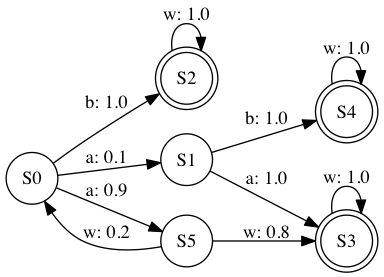

# Monitored MDP Simulator

This project contains a monitored MDP simulator.
The monitor instrumentation can be automatically generated by using the [mdp-generator](https://github.com/SELab-unimi/mdp-generator).

## How do I get set up?

To build the application execute:
```
gradle build
```

## How do I run it?

After `build`, you can run the application by executing `gradle run`.
In particular, the project comes along with a simple example that you can try out by running:
```
gradle run -PappArgs="['-i', 'src/main/resources/tasv3-sut.jmdp', '-l', '1000000']"
```

### Usage intructions

The help message can be shown by using the `-h` option:

```
** MDP Simulator HELP **
Usage: MDPDriver [-hv] -i=<inputMDP> [-l=<limit>]
  -h, --help                  Display this help message
  -i, --input=<inputMDP>      MDP auto-generated description
  -l, --limit=<limit>         Max number of simulations
  -v, --version               Display the version
```

### Simple exmaple

The `sut.jmdp` example contains the definition of the following MDP:



In `sut-model.mdp` we defined two uncertain states: *S0* and *S5*.
In particular, we want to infer the probability distributions associated with the action *a* out of *S0* and the action *w* out of *S5*.
We start from the following *Dirichlet* prior distributions:

```
State: S5, Action: w, Prior: Dir ~ [0.5, 0.5]
State: S0, Action: a, Prior: Dir ~ [0.5, 0.5]
```

At the end of the execution the `Monitor` shows a report. For instance:

```
********* Monitor report *********

Uncertain MDP parameters:
S5:=
    Action: w
    Prior: [0.5, 0.5] --> Posterior: [235.5, 873.5]
    Mode x_i: [0.2126019945602901, 0.7910244786944697]
    Mean E[x_i]: [0.21235347159603246, 0.7876465284039675]
    95% HPD interval: hdi(rdirichlet(100000, c(235.5, 873.5) ), credMass=0.95)
S0:=
    Action: a
    Prior: [0.5, 0.5] --> Posterior: [127.5, 1108.5]
    Mode x_i: [0.10284552845528455, 0.9004065040650406]
    Mean E[x_i]: [0.10315533980582524, 0.8968446601941747]
    95% HPD interval: hdi(rdirichlet(100000, c(127.5, 1108.5) ), credMass=0.95)
```

The `95% HPD interval` can be computed by executing the corresponding printed line in a [R](https://www.r-project.org/) console.
It requires the [HDInterval](https://cran.r-project.org/web/packages/HDInterval/) and [MCMCpack](https://cran.r-project.org/web/packages/MCMCpack/) packages.

## License

See the [LICENSE](LICENSE.txt) file for license rights and limitations (GNU GPLv3).

## Who do I talk to?

* [Matteo Camilli](http://camilli.di.unimi.it): <matteo.camilli@unimi.it>
